# Shopify Store with React

## Created an web app with Shopify App CLI, Node.js and React

- Installed and set up the App CLI with Ruby
- Embedded the store app into the Shopify admin
- Built an interface with Shopify Polaris to access products
- Added React components to the store app
- Used ngrok to expose the local web server to the Internet

## Install

```
install rubyinstaller-devkit-3.0.2-1-x64.exe
install MSYS2 MSYS
gem install shopify-cli
shopify version
2.6.3
shopify help
shopify login
shopify login --store=SuShopStore
shopify node create --name=MyTestApp
cd MyTestApp
shopify serve
shopify populate products
```

## Screenshot

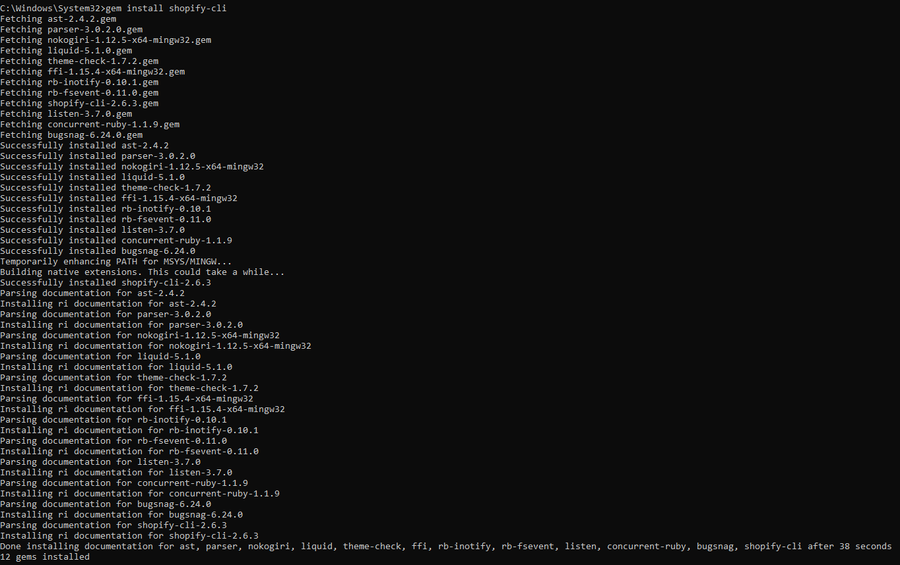

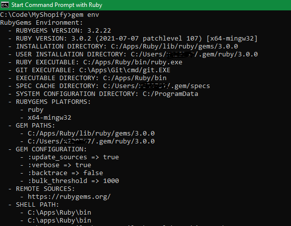

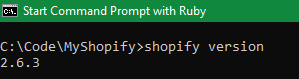

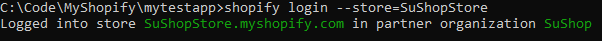

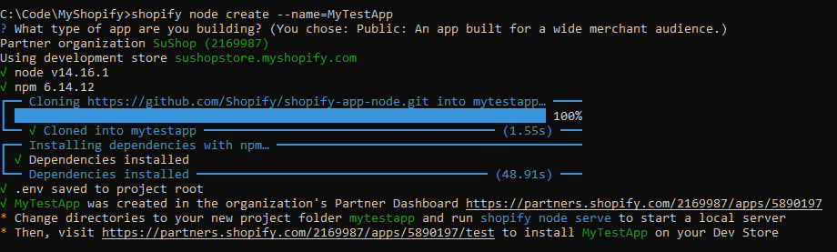

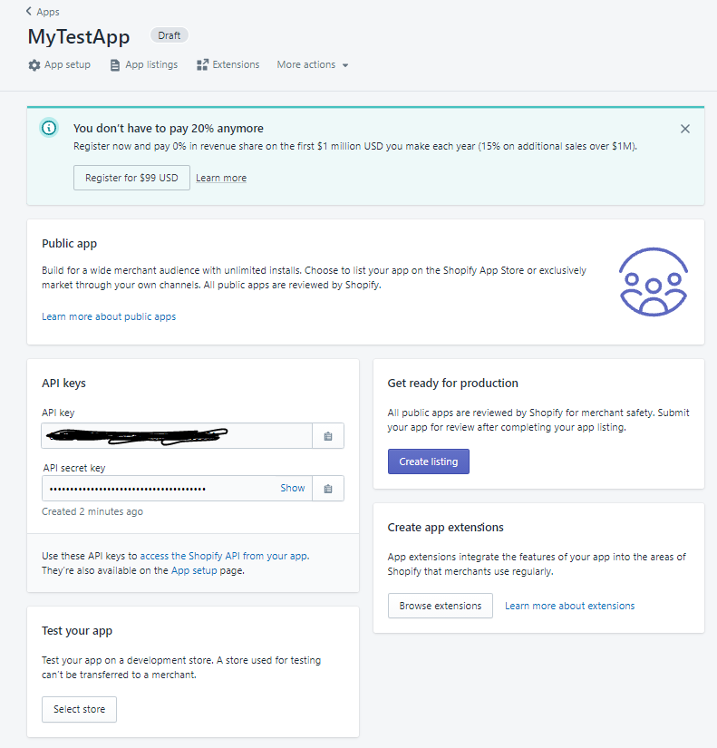

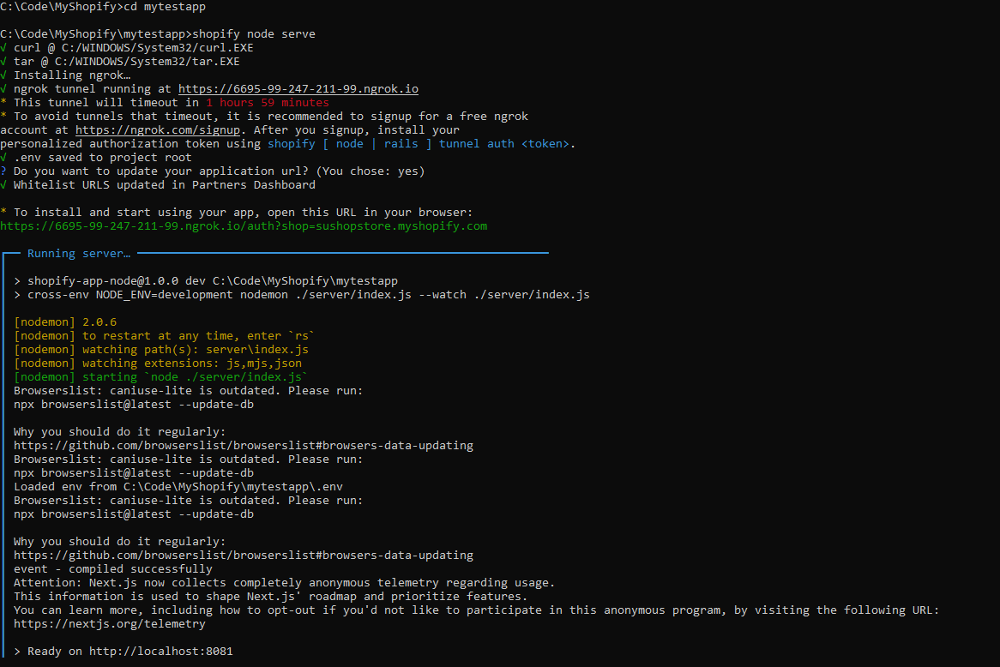

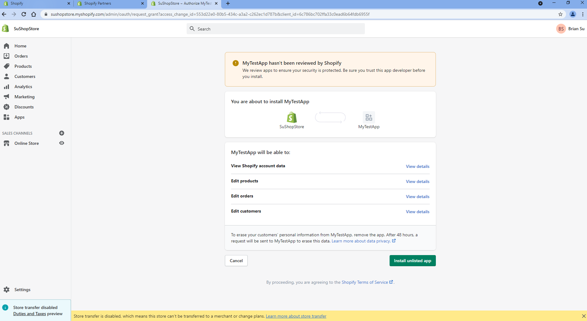

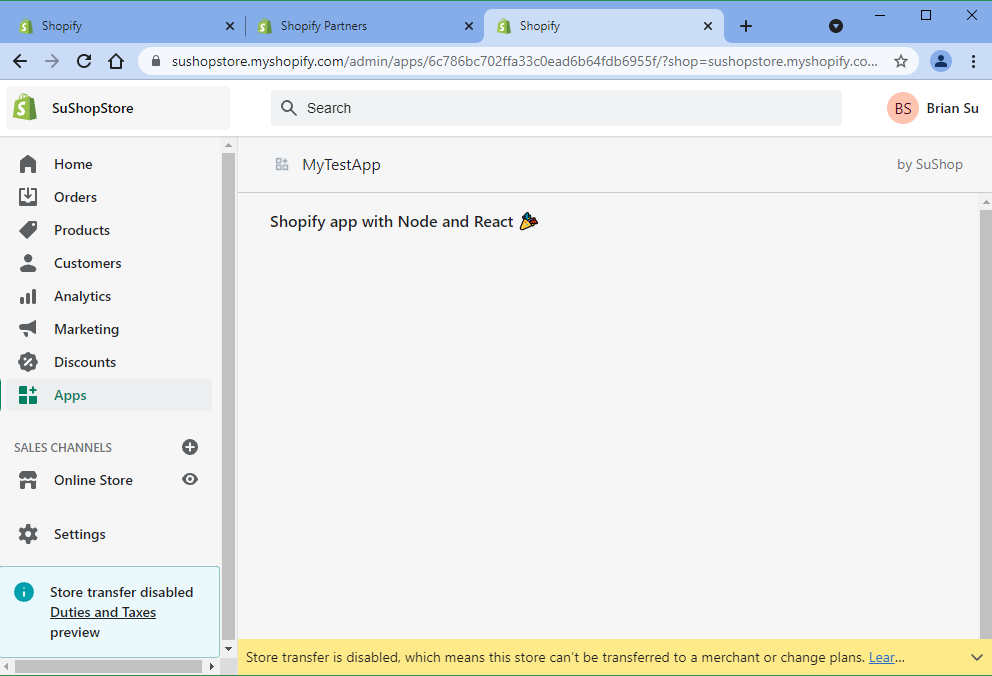

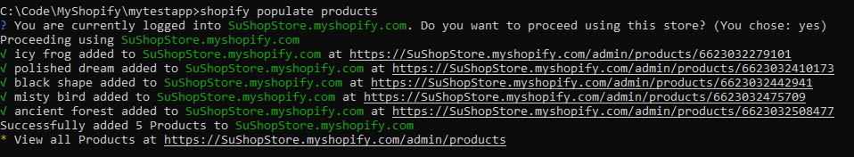

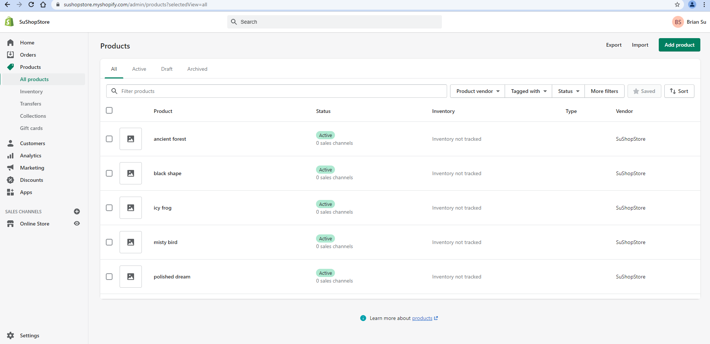

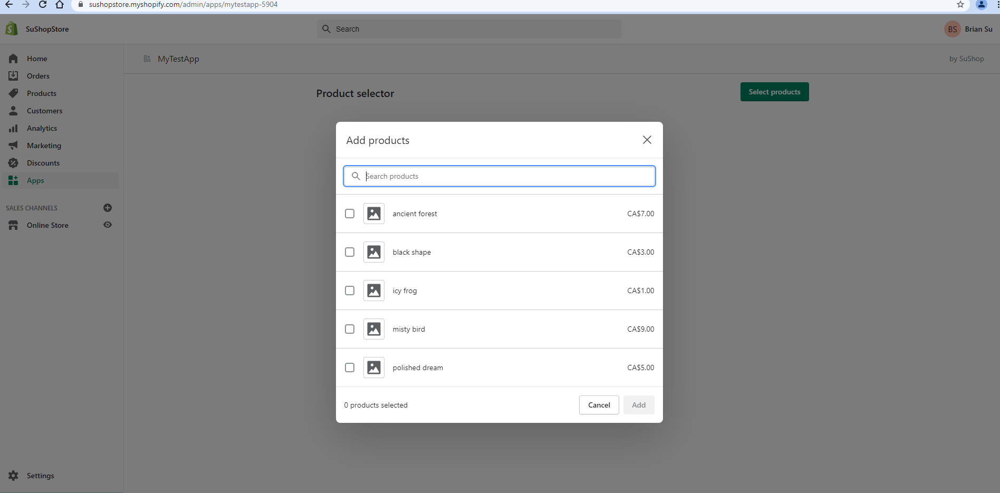

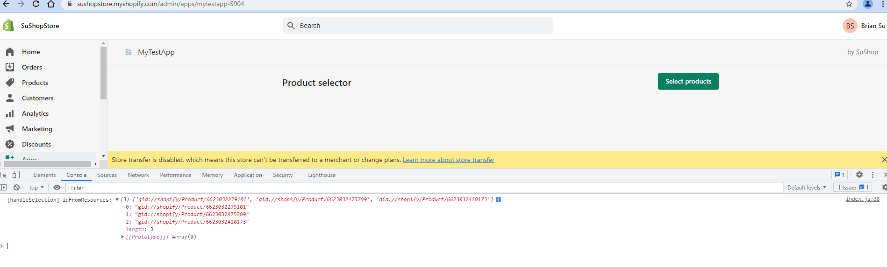
